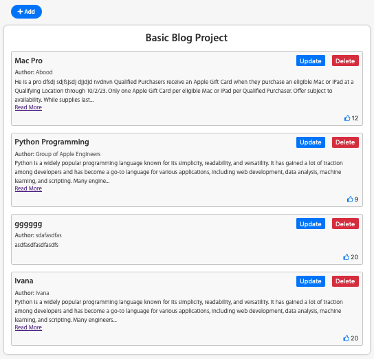
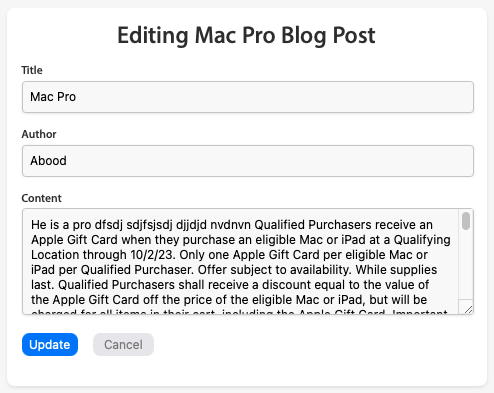

# BasicBlog

Welcome to the BasicBlog Application!

The BasicBlog App is a simple Flask application for managing blog posts. It provides functionality to create, view, update, and delete blog posts.

## Features

- Create new blog posts with author, title, and content fields.
- View individual blog posts.
- Update existing blog posts by modifying the author, title, or content fields.
- Delete blog posts.
- Like blog posts to increment the likes count.
- Store blog posts as JSON data in a file.

## Getting Started

To get started with the BasicBlog  application, follow these steps:

1. Clone the repository from GitHub:

   ```shell
   git clone https://github.com/rsfsalman/BasicBlog.git
   ```

2. Run the application:

   ```shell
   python3 main.py
   ```
3. Run the application:

   ```shell
   Access the application in your web browser at http://localhost:5000.
   ```
## Usage
- Create a new blog post:
  * Click on the "Add Post" link on the home page.
     - Fill in the author, title, and content fields in the provided form.
     Click the "Save" button to create the post.
     View a blog post:
     Click on the title of a post on the home page or use the direct URL with the post ID.
     The post will be displayed with the author, title, content, and likes count.
     Update a blog post:
     View the post you want to update.
     Click the "Update" button to edit the post.
     Modify the author, title, or content fields in the provided form.
     Click the "Save" button to update the post.
     Delete a blog post:
     View the post you want to delete.
     Click the "Delete" button to remove the post.
     Like a blog post:
     View the post you want to like.
     Click the "Like" button to increment the likes count.


<ul style="list-style-type:square">
   <li>Create a new blog post</li>
   <ul style="list-style-type:disc">
      <li>Click on the "Add Post" button on the home page.</li>
      <li>Fill in the author, title, and content fields in the provided form.</li>
      <li>Click the "Submit" button to create the post.</li>
   </ul>

   <li>View a blog post</li>
   <ul style="list-style-type:disc">
      <li>If the content of a post is long, click on Read more link.</li>
      <li>The post will be displayed with the author, title, content, and likes count.</li>
   </ul>

   <li>Update a blog post</li>
   <ul style="list-style-type:disc">
      <li>Locate the desired post on the home page and click on the "Update" button within its corresponding section.</li>
      <li>Fill in the author, title, and content fields in the provided form.</li>
      <li>Click the "Update" button to create the post.</li>
   </ul>


   <li>Delete a blog post</li>
   <ul style="list-style-type:disc">
      <li>Locate the desired post on the home page and click on the "Delete" button within its corresponding section.</li>
   </ul>

   <li>Like a blog post</li>
   <ul style="list-style-type:disc">
      <li>Locate the desired post on the home page and click the "Like" button to increment the likes count.</li>
   </ul>
</ul>

## File Structure

```shell
basic-blog-app/
  ├── globals.py
  ├── main.py
  ├── static/
  │   └── css/
  │       ├── styles.css
  │       └── blog_posts.css
  ├── templates/
  │   ├── add.html
  │   ├── confirm_cancel.html
  │   ├── index.html
  │   ├── post.html
  │   └── update.html
  └── blog_posts.json
```

## Contributing
Contributions to the BestBuy Store project are welcome! If you find any issues or have suggestions for improvements, 
please create an issue on the [GitHub repository](https://github.com/rsfsalman/BasicBlog/issues).

## Contact
For any inquiries or further information, please feel free to reach out to me:

GitHub: [rsfsalman](https://github.com/rsfsalman)

# App in Action
#### Screenshots of BasicBlog in Operation

*The home screen of the app showcasing the main index page, where all the blog posts are displayed.*
<br>
<br>


*An update post screen displaying the form for editing an existing blog post.*
<br>
<br>
